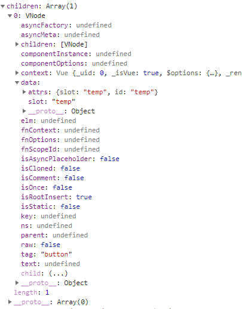

# resolveSlots

这个方法在initRender中用到，我们把它单独拎出来说说
首先贴上源码
```
/**
 * Runtime helper for resolving raw children VNodes into a slot object.
 */
export function resolveSlots (
  children: ?Array<VNode>,
  context: ?Component
): { [key: string]: Array<VNode> } {
  const slots = {}
  if (!children) {
    return slots
  }
  for (let i = 0, l = children.length; i < l; i++) {
    const child = children[i]
    const data = child.data
    // remove slot attribute if the node is resolved as a Vue slot node
    if (data && data.attrs && data.attrs.slot) {
      delete data.attrs.slot
    }
    // named slots should only be respected if the vnode was rendered in the
    // same context.
    if ((child.context === context || child.fnContext === context) &&
      data && data.slot != null
    ) {
      const name = data.slot
      const slot = (slots[name] || (slots[name] = []))
      if (child.tag === 'template') {
        slot.push.apply(slot, child.children || [])
      } else {
        slot.push(child)
      }
    } else {
      (slots.default || (slots.default = [])).push(child)
    }
  }
  // ignore slots that contains only whitespace
  for (const name in slots) {
    if (slots[name].every(isWhitespace)) {
      delete slots[name]
    }
  }
  return slots
}
```
作者给了注释
>Runtime helper for resolving raw children VNodes into a slot object.

翻译下‘运行时用于将原始子VNode解析为槽对象。’可见是获取slots(插槽)的内容。

入参有两个
children：即将要显示在插槽位置的子节点
context：调用处传参parentVnode && parentVnode.context可知，是父节点的上下文。

可能有的人还是不知道children是什么，因为从Vue的构造函数一步步看到这，并没有发现在哪里给_renderChildren赋值了，其实我们在调用Vue的构造函数之前，代码就已经做好很多额外的工作，我们先不要纠结属性是在哪赋值的，在后边的学习中会一点一点展开的。

我们看看实际运行时children是什么
demo 代码
```
// html
<div id="app"><comp-a @test.once="test" @hook:other="other"><button id="temp" slot="temp">content</button></comp-a><br/></div>

//script
var subVm = {
  template: '<span @click="showName">hh</span>',
  mounted() {
      console.log('mounted');
  },
  methods: {
      showName() {
          console.log('name');
      }
  }
};
var vm = new Vue({
  el: document.getElementById('app'),
  components: {
    'comp-a': subVm
  },
  methods: {
    test() {
      console.log('test');
    },
    other() {
      console.log('other');
    }
  }
});
```
运行上边demo，传入的children就是'omp-a'标签中的button，
我们看下具体的children


我们可以发现children数组里有一个元素，是一个Vnode对象，此刻我们先假设是Vue在其他地方进行了操作，将dom节点转为了虚拟节点（等我们看到具体的操作代码时再来补充）。但是其实际内容就是我们在组件中写的button。


我们逐行看一下
```
const slots = {}
```
定义要返回的结果，即组件内出现的结构
```
  if (!children) {
    return slots
  }
```
如果children不存在，说明没有需要在插槽显示的内容，则直接返回。
接下来是个for循环，循环遍历children数组中的每一项
我们直接进入到数组中看
```
  const child = children[i]
  const data = child.data
```
将当前循环的元素缓存到child中，将当前循环对象的data属性缓存到data中。

这里我们再说下data属性。
从上边的demo可以看到，这里data中包含两个属性，一个是attrs，一个是slot，attrs中是在标签上定义的属性，slot是将attrs中的属性单独拿出来存了。

我们继续看代码
```
  // remove slot attribute if the node is resolved as a Vue slot node
  if (data && data.attrs && data.attrs.slot) {
    delete data.attrs.slot
  }
```
从作者注释和代码可以得知，如果该节点是作为Vue的插槽使用的，则将attrs中的slot属性删除。
简单点说其实就是如果attrs中有slot属性的话，删除。
```
  // named slots should only be respected if the vnode was rendered in the
  // same context.
  if ((child.context === context || child.fnContext === context) &&
    data && data.slot != null
  ) {
    const name = data.slot
    const slot = (slots[name] || (slots[name] = []))
    if (child.tag === 'template') {
      slot.push.apply(slot, child.children || [])
    } else {
      slot.push(child)
    }
  } else {
    (slots.default || (slots.default = [])).push(child)
  }
```
这里我们首先要知道Vue中插槽分具名插槽和默认插槽，上边代码就是做这两种的区分操作。
首先，如果是具名插槽，并且该Vnode节点的上下文同组件的renderContext一样的话，进入到if分支，如果不满足以上条件，则将该节点放入到默认插槽数组中。
下面我们进入的if分支里看看。
```
const name = data.slot
```
取出具名插槽的名字
```
const slot = (slots[name] || (slots[name] = []))
```
如果slots总有该名称的插槽，取出来，没有的话将该具名插槽加入到返回的slots中，初始值位空数组。
```
  if (child.tag === 'template') {
    slot.push.apply(slot, child.children || [])
  } else {
    slot.push(child)
  }
```
如果你看过官方文档，这两行代码应该很好理解，即当改节点的标签为template时，最终在渲染时template标签是不会被渲染到页面的，所以只把template中的子节点取出来即可；如果标签不是template，则直接插入slot中。
```
  // ignore slots that contains only whitespace
  for (const name in slots) {
    if (slots[name].every(isWhitespace)) {
      delete slots[name]
    }
  }
```

根据注释：忽略所以只包含空白字符的内容。
every就是对数组的每一项执行回调函数，返回执行的结果
看下isWhitespace的定义
```
function isWhitespace (node: VNode): boolean {
  return (node.isComment && !node.asyncFactory) || node.text === ' '
}
```
如果节点是注释，或者节点的内容为空格，返回true。
最后
```
return slots
```
返回需要渲染的节点。