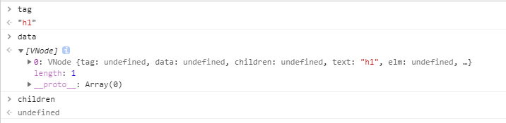
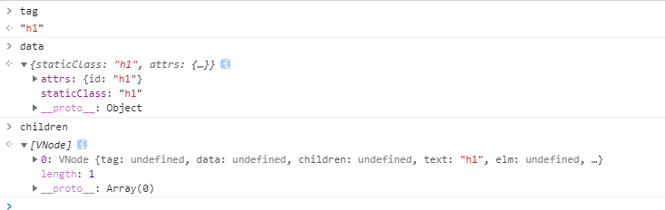

# createElement

从方法名可知，该方法会创建一个元素。
废话不多说，上源码。
```
// wrapper function for providing a more flexible interface
// without getting yelled at by flow
export function createElement (
  context: Component,
  tag: any,
  data: any,
  children: any,
  normalizationType: any,
  alwaysNormalize: boolean
): VNode | Array<VNode> {
  if (Array.isArray(data) || isPrimitive(data)) {
    normalizationType = children
    children = data
    data = undefined
  }
  if (isTrue(alwaysNormalize)) {
    normalizationType = ALWAYS_NORMALIZE
  }
  return _createElement(context, tag, data, children, normalizationType)
}
```
这个方法主要是将_createElement进行二次包装，已提供一个更加灵活的接口。

方法的参数在initRender中作者给过注释，这里就不再赘述了。

首先
```
  if (Array.isArray(data) || isPrimitive(data)) {
    normalizationType = children
    children = data
    data = undefined
  }
```
如果data是数组，或基本类型，则将children赋值给normalizationType，将data赋值给children。
下面是isPrimitive的定义。
```
/**
 * Check if value is primitive.
 */
export function isPrimitive (value: any): boolean %checks {
  return (
    typeof value === 'string' ||
    typeof value === 'number' ||
    // $flow-disable-line
    typeof value === 'symbol' ||
    typeof value === 'boolean'
  )
}
```

对于data和children的取值，应该是vue在模板字符串解析时产生的，具体是怎么产生的，这里还不能下定论，等后期看到模板解析时再详说。
这里我进行了两次试验，分别看了data和children的取值
demo1
```
//html
<div id="app"><comp-b><h1>h1</h1>123</comp-b></div>
//script
var child2 = {
    template: '<p>child2</p>'
  }
  var vm = new Vue({
    el: document.getElementById('app'),
    components: {
      'comp-b': child2
    }
  });
```
我们打断点看下



从tag可以看出，此时正在创建&lt;h1&gt;标签的节点元素，data是一个数组，数组里的元素也是一个节点，text值为h1，而children的值是undefined。

我们将上边的demo稍作修改
```
//html
<div id="app"><comp-b><h1 class="h1" id="h1">h1</h1>123</comp-b></div>
```

我们只是为h1标签添加了class和id属性，再看下此时的入参



data和children发生了变化，data的值为标签的属性，而children此时为标签内的节点h1.

具体为什么等我们看了模板解析再来解答。
此时可以解答
```
  normalizationType = children
  children = data
  data = undefined
```
即当data为数组时，其实data里存放的就是该节点的子节点，所以讲data赋值给了children。

我们再继续往下看
```
  if (isTrue(alwaysNormalize)) {
    normalizationType = ALWAYS_NORMALIZE
  }
```
如果alwaysNormalize为true，则将ALWAYS_NORMALIZE枚举的值赋值给normalizationType

最后
```
return _createElement(context, tag, data, children, normalizationType)
```
返回了_createElement。

由于_createElement篇幅较长，我们单独说。