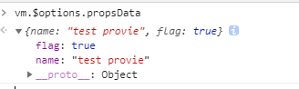

# initState

initState 方法主要是对 props、methods、data、computed 和 wathcer 等属性做了初始化操作。

initState 的代码将各个属性的初始化拆分成各个功能块。下面我们一个一个的看看。

## initProps

props 的初始化主要过程，就是遍历定义的 props 配置。遍历的过程主要做两件事情：一个是调用 defineReactive 方法把每个 prop 对应的值变成响应式，可以通过 vm.\_props.xxx 访问到定义 props 中对应的属性。对于 defineReactive 方法，我们稍后会介绍；另一个是通过 proxy 把 vm._props.xxx 的访问代理到 vm.xxx 上。

`if (opts.props) initProps(vm, opts.props)`当实例属性中存在props属性时，就会调用initProps方法。

```
  const propsData = vm.$options.propsData || {}
```
propsData 拿到props对应的值。这里之前在看_init时，如果是组件会执行一段代码
```
  //initInternalComponent
  const parentVnode = options._parentVnode
  opts.parent = options.parent
  opts._parentVnode = parentVnode

  const vnodeComponentOptions = parentVnode.componentOptions
  opts.propsData = vnodeComponentOptions.propsData
```
此时propsData里就是存的对应的真实值。
看个例子
```
//html
  <div id="app"><c-m :name="name" :flag="flag"></c-m></div>
//script
  var vm = new Vue({
    el: '#app',
    data: {
      name: 'test provie',
      flag: true
    },
    components: {
      'c-m': cvm //子组件的定义此处省略，就是最简单的那种
    }
  });
```
我们打下断点看下propsData的值



这样是不是就清晰了。

`const props = vm._props = {}`这里在实例上添加了_props属性，并将props变量指向它。

```
  // cache prop keys so that future props updates can iterate using Array
  // instead of dynamic object key enumeration.
  const keys = vm.$options._propKeys = []
```
这行代码，根据作者注释可以知道，在实例的选项上定义_propKeys数组，以便将来更新时可以使用数组的方式替代动态对象枚举进行迭代的方式，更方便了。
`const isRoot = !vm.$parent`判断当前实例是否为顶级根元素。如果不是根元素的话暂时禁用观察。

接下来是循环遍历每个props选项
`keys.push(key)`将每项写key存入_propKeys中。
`const value = validateProp(key, propsOptions, propsData, vm)`取到选项的值，然后为选项实现响应式，主要是defineReactive方法。

最后
```
  if (!(key in vm)) {
    proxy(vm, `_props`, key)
  }
```
通过proxy，将_props.xxx的访问代理到vm.xxx上。

## initMethods

initMethods方法比较简单，将options中的method添加为当前实例的方法，并绑定方法的上下文（this）.
`vm[key] = methods[key] == null ? noop : bind(methods[key], vm)`

## initData

data 的初始化主要过程是做两件事，一个是对定义 data 函数返回对象的遍历，通过 proxy 把每一个值 vm.\_data.xxx 都代理到 vm.xxx 上；另一个是调用 observe 方法观测整个 data 的变化，把 data 也变成响应式，可以通过 vm._data.xxx 访问到定义 data 返回函数中对应的属性。

## initComputed

```
function initComputed (vm: Component, computed: Object) {
  //创建一个空对象，用于存储计算属性对应的watcher
  const watchers = vm._computedWatchers = Object.create(null)
  // computed properties are just getters during SSR
  const isSSR = isServerRendering()
  //循环遍历计算属性
  for (const key in computed) {
    //拿到当前计算属性的定义
    const userDef = computed[key]
    //定义计算属性的getter，如果userDef是函数，则赋值给getter，否则取对象的get
    const getter = typeof userDef === 'function' ? userDef : userDef.get
    if (process.env.NODE_ENV !== 'production' && getter == null) {
      warn(
        `Getter is missing for computed property "${key}".`,
        vm
      )
    }

    if (!isSSR) {
      //每一个 getter 创建一个 watcher
      //注意这里的watcher是计算watcher和渲染watcher不太一样
      // create internal watcher for the computed property.
      watchers[key] = new Watcher(
        vm,
        getter || noop,
        noop,
        computedWatcherOptions
      )
    }

    // component-defined computed properties are already defined on the
    // component prototype. We only need to define computed properties defined
    // at instantiation here.
    //判断如果 key 不是 vm 的属性，则调用 defineComputed(vm, key, userDef)
    if (!(key in vm)) {
      defineComputed(vm, key, userDef)
    } else if (process.env.NODE_ENV !== 'production') {
      if (key in vm.$data) {
        warn(`The computed property "${key}" is already defined in data.`, vm)
      } else if (vm.$options.props && key in vm.$options.props) {
        warn(`The computed property "${key}" is already defined as a prop.`, vm)
      }
    }
  }
}
```

函数首先创建 vm._computedWatchers 为一个空对象，接着对 computed 对象做遍历，拿到计算属性的每一个 userDef，然后尝试获取这个 userDef 对应的 getter 函数，拿不到则在开发环境下报警告。接下来为每一个 getter 创建一个 watcher，这个 watcher 和渲染 watcher 有一点很大的不同，它是一个 computed watcher，因为 const computedWatcherOptions = { lazy: true }。computed watcher 和普通 watcher 的差别我稍后会介绍。最后对判断如果 key 不是 vm 的属性，则调用 defineComputed(vm, key, userDef)，否则判断计算属性对于的 key 是否已经被 data 或者 prop 所占用，如果是的话则在开发环境报相应的警告。

```
export function defineComputed (
  target: any,
  key: string,
  userDef: Object | Function
) {
  const shouldCache = !isServerRendering()
  if (typeof userDef === 'function') {
    sharedPropertyDefinition.get = shouldCache
      ? createComputedGetter(key)
      : userDef
    sharedPropertyDefinition.set = noop
  } else {
    sharedPropertyDefinition.get = userDef.get
      ? shouldCache && userDef.cache !== false
        ? createComputedGetter(key)
        : userDef.get
      : noop
    sharedPropertyDefinition.set = userDef.set
      ? userDef.set
      : noop
  }
  if (process.env.NODE_ENV !== 'production' &&
      sharedPropertyDefinition.set === noop) {
    sharedPropertyDefinition.set = function () {
      warn(
        `Computed property "${key}" was assigned to but it has no setter.`,
        this
      )
    }
  }
  Object.defineProperty(target, key, sharedPropertyDefinition)
}
```
这段逻辑很简单，其实就是利用 Object.defineProperty 给计算属性对应的 key 值添加 getter 和 setter，setter 通常是计算属性是一个对象，并且拥有 set 方法的时候才有，否则是一个空函数。在平时的开发场景中，计算属性有 setter 的情况比较少，我们重点关注一下 getter 部分，缓存的配置也先忽略，最终 getter 对应的是 createComputedGetter(key) 的返回值，来看一下它的定义：
```
function createComputedGetter (key) {
  return function computedGetter () {
    const watcher = this._computedWatchers && this._computedWatchers[key]
    if (watcher) {
      if (watcher.dirty) {
        watcher.evaluate()
      }
      if (Dep.target) {
        watcher.depend()
      }
      return watcher.value
    }
  }
}
```
createComputedGetter 返回一个函数 computedGetter，它就是计算属性对应的 getter。

这里判断是否存在脏数据，如果存在，则调用evaluate，
```
  evaluate () {
    this.value = this.get()
    this.dirty = false
  }
```
evaluate的方法就是执行最初用户定义计算属性时的getter，即上文中的userDef。
执行完后，值已经是最新的，即不存在脏数据了，将dirty置为false。
在判断Dep.target是否存在，Dep.target是一个全局的watcher，在dep.js中定义。
如果存在，则调用watcher的depend方法进行依赖收集。
```
  depend () {
    let i = this.deps.length
    while (i--) {
      this.deps[i].depend()
    }
  }
```

## initWatch

```
function initWatch (vm: Component, watch: Object) {
  for (const key in watch) {
    const handler = watch[key]
    if (Array.isArray(handler)) {
      for (let i = 0; i < handler.length; i++) {
        createWatcher(vm, key, handler[i])
      }
    } else {
      createWatcher(vm, key, handler)
    }
  }
}
```
这里就是对 watch 对象做遍历，拿到每一个 handler，因为 Vue 是支持 watch 的同一个 key 对应多个 handler，所以如果 handler 是一个数组，则遍历这个数组，调用 createWatcher 方法，否则直接调用 createWatcher：
```
function createWatcher (
  vm: Component,
  keyOrFn: string | Function,
  handler: any,
  options?: Object
) {
  if (isPlainObject(handler)) {
    options = handler
    handler = handler.handler
  }
  if (typeof handler === 'string') {
    handler = vm[handler]
  }
  return vm.$watch(keyOrFn, handler, options)
}
```
这里的逻辑也很简单，首先对 hanlder 的类型做判断，拿到它最终的回调函数，最后调用 vm.$watch(keyOrFn, handler, options) 函数，$watch 是 Vue 原型上的方法，它是在执行 stateMixin 的时候定义的：
```
  Vue.prototype.$watch = function (
    expOrFn: string | Function,
    cb: any,
    options?: Object
  ): Function {
    const vm: Component = this
    if (isPlainObject(cb)) {
      return createWatcher(vm, expOrFn, cb, options)
    }
    options = options || {}
    options.user = true
    const watcher = new Watcher(vm, expOrFn, cb, options)
    if (options.immediate) {
      cb.call(vm, watcher.value)
    }
    return function unwatchFn () {
      watcher.teardown()
    }
  }
```
也就是说，侦听属性 watch 最终会调用 $watch 方法，这个方法首先判断 cb 如果是一个对象，则调用 createWatcher 方法，这是因为 $watch 方法是用户可以直接调用的，它可以传递一个对象，也可以传递函数。接着执行 const watcher = new Watcher(vm, expOrFn, cb, options) 实例化了一个 watcher，这里需要注意一点这是一个 user watcher，因为 options.user = true。通过实例化 watcher 的方式，一旦我们 watch 的数据发送变化，它最终会执行 watcher 的 run 方法，执行回调函数 cb，并且如果我们设置了 immediate 为 true，则直接会执行回调函数 cb。最后返回了一个 unwatchFn 方法，它会调用 teardown 方法去移除这个 watcher。