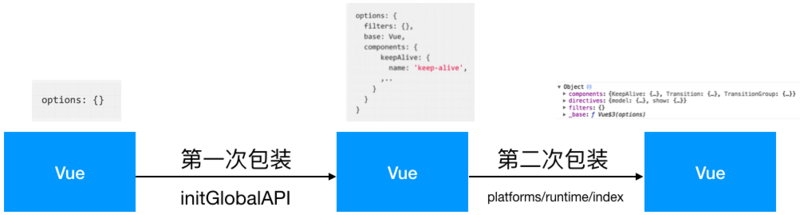

# resolveConstructorOptions

此方法有两种情况，一是通过Vue构造函数创建的实例，还有一种是通过Vue.extend创建的实例
```
export function resolveConstructorOptions (Ctor: Class<Component>) {
  let options = Ctor.options
  // 有super说明Ctor是通过extend构建的子类
  if (Ctor.super) {
    const superOptions = resolveConstructorOptions(Ctor.super)
    const cachedSuperOptions = Ctor.superOptions
    if (superOptions !== cachedSuperOptions) {
      // super option changed,
      // need to resolve new options.
      Ctor.superOptions = superOptions
      // check if there are any late-modified/attached options (#4976)
      const modifiedOptions = resolveModifiedOptions(Ctor)
      // update base extend options
      if (modifiedOptions) {
        extend(Ctor.extendOptions, modifiedOptions)
      }
      options = Ctor.options = mergeOptions(superOptions, Ctor.extendOptions)
      if (options.name) {
        options.components[options.name] = Ctor
      }
    }
  }
  return options
}
```

## ctor是基础Vue构造器
ctor.options的结构如下图


此时到这里，我们并没有看到过这几个选项，构造器里也没有设置，那么是在哪设置的呢？

```
  // src/core/index.js
  import Vue from './instance/index'
  import { initGlobalAPI } from './global-api/index'
  import { isServerRendering } from 'core/util/env'
  import { FunctionalRenderContext } from 'core/vdom/create-functional-component'

  initGlobalAPI(Vue)

  // src/core/global-api/index.js
  Vue.options = Object.create(null)
  ASSET_TYPES.forEach(type => {
    Vue.options[type + 's'] = Object.create(null)
  })

  // this is used to identify the "base" constructor to extend all plain-object
  // components with in Weex's multi-instance scenarios.
  Vue.options._base = Vue

  // Vue.options.components添加KeepAlive属性
  extend(Vue.options.components, builtInComponents)

  // src/shared/constants.js
  export const ASSET_TYPES = [
    'component',
    'directive',
    'filter'
  ]

  // src/platforms/web/runtime/index.js
  // Vue.options.directives添加model,show属性
  extend(Vue.options.directives, platformDirectives)
  // Vue.options.components添加Transition,TransitionGroup属性
  extend(Vue.options.components, platformComponents)
```

通过上述代码Vue构造函数的options对象就生成了。
下面引用一张网上的图片



## Ctor是Vue.extend创建的"子类"
如果Ctor是Vue.extend创建的"子类"，那么在extend的过程中，Ctor上就会有super属性。

```
const Sub = function VueComponent (options) {
  this._init(options)
}
...
Sub['super'] = Super
...
```
Ctor上有了super属性，就会去执行if块内的代码
```
  if (Ctor.super) {
    const superOptions = resolveConstructorOptions(Ctor.super)
    const cachedSuperOptions = Ctor.superOptions
    ...
  }
  // Vue.extend相关代码
  Vue.extend = function (extendOptions: Object): Function {
    ...
    Sub.superOptions = Super.options // Sub.superOptions指向基础构造器的options
    ...
  }
```
首先递归调用resolveConstructorOptions方法，返回"父类"上的options并赋值给superOptions变量。然后把"自身"的superOptions赋值给cachedSuperOptions变量。
然后比较这两个变量的值,当这两个变量值不等时，说明"父类"的options改变过了。
例如执行了Vue.mixin方法，这时候就需要把"自身"的superOptions属性替换成最新的。然后检查是否"自身"的options是否发生变化。resolveModifiedOptions的功能就是这个。
```
if (superOptions !== cachedSuperOptions) {
  // super option changed,
  // need to resolve new options.
  Ctor.superOptions = superOptions
  // check if there are any late-modified/attached options (#4976)
  const modifiedOptions = resolveModifiedOptions(Ctor)
  ....
}
```
例子来说明一下。
```
  var subVm = Vue.component('comp-a', {
    template: '<span>{{type}}</span>',
  });
  // 此处通过mixin改变了Vue构造函数的options
  Vue.mixin({data: function() {
    return {
      type: 'component'
    };
  }});
  var vm = new Vue({
    el: document.getElementById('app'),
    components: {
      subVm
    }
  });
```
上边例子中因为父类的options改变了，导致superOptions和cachedSuperOptions就不相等了。

## resolveModifiedOptions
```
function resolveModifiedOptions (Ctor: Class<Component>): ?Object {
  let modified
  const latest = Ctor.options // 自身的options
  const extended = Ctor.extendOptions // 构造"自身"时传入的options
  const sealed = Ctor.sealedOptions // 封装的自身options的一个副本，方便比较是否发生了变化
  // 循环遍历自身选项，如果有变化，则更新选项
  for (const key in latest) {
    if (latest[key] !== sealed[key]) {
      if (!modified) modified = {}
      modified[key] = dedupe(latest[key], extended[key], sealed[key])
    }
  }
  return modified
}
```
在看dedupe函数
```
function dedupe (latest, extended, sealed) {
  // compare latest and sealed to ensure lifecycle hooks won't be duplicated
  // between merges
  if (Array.isArray(latest)) {
    const res = []
    sealed = Array.isArray(sealed) ? sealed : [sealed]
    extended = Array.isArray(extended) ? extended : [extended]
    for (let i = 0; i < latest.length; i++) {
      // push original options and not sealed options to exclude duplicated options
      if (extended.indexOf(latest[i]) >= 0 || sealed.indexOf(latest[i]) < 0) {
        res.push(latest[i])
      }
    }
    return res
  } else {
    return latest
  }
}
```
从作者的注释可以看到这个方法主要就是防止生命周期构造函数重复。我们再来看该方法传入的3个参数。latest，extended，sealed，lateset表示的是"自身"新增的options。extended表示的是当前构造器上新增的extended options，sealed表示的是当前构造器上新增的封装options。
回到源码，如果latest不是数组的话(lateset是"自身"新增的options)，这里不需要去重，直接返回latest。如果传入的latest是数组（如果latest是数组，一般这个新增的options就是生命周期钩子函数），则遍历该数组，如果该数组的某项在extended数组中有或者在sealed数组中没有，则推送到返回数组中从而实现去重。

```
// src/shared/util.js
// 单纯的合并选项
export function extend (to: Object, _from: ?Object): Object {
  for (const key in _from) {
    to[key] = _from[key]
  }
  return to
}
```

```
if (modifiedOptions) {
  extend(Ctor.extendOptions, modifiedOptions)
}
options = Ctor.options = mergeOptions(superOptions, Ctor.extendOptions)
if (options.name) {
  options.components[options.name] = Ctor
}
```
如果”自身“有新添加的options，则把新添加的options属性添加到Ctor.extendOptions属性上。调用mergeOptions方法合并"父类"构造器上的options和”自身“上的extendOptions(mergeOptions在下一篇博文中介绍)，最后返回合并后的options。