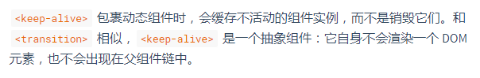

# initLifecycle

看完initProxy，接下来看initLifecycle的实现
initLifeCycle方法用来初始化一些生命周期相关的属性，以及为parent,child等属性赋值，来看源码。
```
export function initLifecycle (vm: Component) {
  const options = vm.$options

  // locate first non-abstract parent
  let parent = options.parent
  if (parent && !options.abstract) {
    while (parent.$options.abstract && parent.$parent) {
      parent = parent.$parent
    }
    parent.$children.push(vm)
  }

  vm.$parent = parent
  vm.$root = parent ? parent.$root : vm

  vm.$children = []
  vm.$refs = {}

  vm._watcher = null
  vm._inactive = null
  vm._directInactive = false
  vm._isMounted = false
  vm._isDestroyed = false
  vm._isBeingDestroyed = false
}
```
一行一行分析
```
const options = vm.$options
```
将mergeOptions合并后的选项赋值给options
```
  // locate first non-abstract parent
  let parent = options.parent
  if (parent && !options.abstract) {
    while (parent.$options.abstract && parent.$parent) {
      parent = parent.$parent
    }
    parent.$children.push(vm)
  }
```
我们注意到，vue作者对这段代码提供了一行注释
>locate first non-abstract parent

定位第一个"非抽象"的父组件，注意非抽象这三个字。什么是非抽象呢？最初自己也很疑惑，最后在vue文档中找到了答案。



抽象组件的定义如上图所示，注意这句话，不会出现在父组件链中。明白了这点我们再去看上面的代码就不会有那么迷糊了。
```
let parent = options.parent
if (parent && !options.abstract) {
    ...
}
```
当前vm实例有父实例parent，则赋值给parent变量。如果父实例存在，且该实例不是抽象组件。则执行下面代码
```
    while (parent.$options.abstract && parent.$parent) {
      parent = parent.$parent
    }
    parent.$children.push(vm)
```
注意while循环内的条件parent.$options.abstract && parent.$parent,如果父实例parent是抽象组件，则继续找parent上的parent。直到找到非抽象组件为止。之后把当前vm实例push到定位的第一个非抽象parent的$children属性上。这样我们就说完了怎么找vm的parent属性。

之后我们回到initLifecycle继续往下看
```
  vm.$parent = parent
  vm.$root = parent ? parent.$root : vm

  vm.$children = []
  vm.$refs = {}

  vm._watcher = null
  vm._inactive = null
  vm._directInactive = false
  vm._isMounted = false
  vm._isDestroyed = false
  vm._isBeingDestroyed = false
```
这些代码都是为vm一些属性赋值。这些属性的作用如下表。

名称|说明
---|---
$parent|父实例，如果当前实例有的话。
$root|当前组件树的根 Vue 实例。如果当前实例没有父实例，此实例将会是其自己。
$children|当前实例的直接子组件。需要注意 $children 并不保证顺序，也不是响应式的。
$refs|一个对象，持有注册过 ref 特性 的所有 DOM 元素和组件实例。
_watcher|组件实例相应的 watcher 实例对象。
_inactive|表示keep-alive中组件状态，如被激活，该值为false,反之为true。
_directInactive|也是表示keep-alive中组件状态的属性。
_isMounted|当前实例是否完成挂载(对应生命周期图示中的mounted)。
_isDestroyed|当前实例是否已经被销毁(对应生命周期图示中的destroyed)。
_isBeingDestroyed|当前实例是否正在被销毁,还没有销毁完成(介于生命周期图示中deforeDestroy和destroyed之间)。

initLifecycle方法的逻辑比较简单，主要对vue实例一些属性进行赋值。
