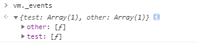
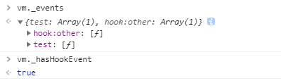

# initEvents

看完initLifecycle，接下来看initEvents。先看下initEvents方法的实现
```
export function initEvents (vm: Component) {
  vm._events = Object.create(null)
  vm._hasHookEvent = false
  // init parent attached events
  const listeners = vm.$options._parentListeners
  if (listeners) {
    updateComponentListeners(vm, listeners)
  }
}
```
代码第一行

`vm._events = Object.create(null)`

该行代码创建了一个原型为null的空对象，并把它赋值给vm实例的_events属性。
从命名来看，\_events存放的是事件，但是\_events属性到底存放的是什么呢，我们先看个例子。
```
<div id="app"><comp-a @test="test" @other="other"></comp-a></div>

// js代码如下
var subVm = Vue.component('comp-a', {
  template: '<span @click="showName">hhf </span>',
  mounted() {
    console.log('mounted');
  },
  methods: {
    showName() {
      console.log('name');
    }
  }
});
var vm = new Vue({
  el: document.getElementById('app'),
  components: {
    subVm
  },
  methods: {
    test() {
      console.log('test');
    },
    other() {
      console.log('other');
    }
  }
});
```
再看下_events里的内容



上面例子中，child组件上除了父组件绑定的方法之外，其组件内部还有click和mounted钩子方法，但是这两个方法都没有出现在_events属性中。综上可知，vm._events表示的是父组件绑定在当前组件上的事件。

接下来继续看代码

`vm._hasHookEvent = false`

这行代码把我们vm实例上的_hasHookEvent属性设置为false。该属性表示父组件是否通过"@hook:"把钩子函数绑定在当前组件上。在上个demo中我们没有设置以‘hook:’开头的事件，下面我们修改一下上边的例子。
```
<div id="app"><comp-a @test="test" @hook:other="other"></comp-a><br/></div>
```
此时我们再看下\_events和\_hasHookEvent的值



此时_hasHookEvent的值位true

具体的代码我们可以在eventsMixin中找到
```
const hookRE = /^hook:/
if (hookRE.test(event)) {
  vm._hasHookEvent = true
}
```
上边两行代码使用正则判断事件是否已‘hook:’开头。如果是则为true。

我们继续开initEvents的代码
```
// init parent attached events
const listeners = vm.$options._parentListeners
```
从英文注释中，我们知道这行代码的作用是初始化父组件添加的事件。那具体是什么意思呢？通过追踪vm.$options.\_parentListeners的赋值过程（这个过程有点复杂，在之后讲双向绑定和虚拟dom的时候会说到),我们知道vm.$options.\_parentListeners其实和上面的_events一样，都是用来表示父组件绑定在当前组件上的事件。（当然还是略有点不同，这个之后会讲解）如果存在这些绑定的事件，那么就执行下面代码
```
if (listeners) {
  updateComponentListeners(vm, listeners)
}
```
如果事件存在，则调用updateComponentListeners更新这些方法。
```
export function updateComponentListeners (
  vm: Component,
  listeners: Object,
  oldListeners: ?Object
) {
  target = vm
  updateListeners(listeners, oldListeners || {}, add, remove, vm)
  target = undefined
}
```
来看updateComponentListeners方法的源码

`target = vm`

这行代码的主要作用是保留对vm实例的引用，在执行updateListeners方法时能访问到实例对象，并执行add和remove方法。

`updateListeners(listeners, oldListeners || {}, add, remove, vm)`

在研究updateListeners源码之前，我们先来了解一下传入的这几个参数。listeners我们前面说过，是父组件绑定在当前组件上的事件对象，oldListeners表示当前组件上旧的事件对象，vm是vue实例对象。这三个没什么好说的，我们具体来讲讲另外两个参数add和remove。

## add 方法
```
function add (event, fn, once) {
  if (once) {
    target.$once(event, fn)
  } else {
    target.$on(event, fn)
  }
}
```
如果第三个参数once为true，则执行vue.$once方法，否则执行vue.$on方法。我们先来看vue.$on

### vm.$on 方法
为什么要先讲$on方法，因为$once方法中也需要用到$on,在看$on源码之前，我们先来看看官方文档里对它的定义。
>监听当前实例上的自定义事件。事件可以由vm.$emit触发。回调函数会接收所有传入事件触发函数的额外参数。

知道了vue.$on的定义之后，我们再来看源码。
```
  Vue.prototype.$on = function (event: string | Array<string>, fn: Function): Component {
    const vm: Component = this
    if (Array.isArray(event)) {
      for (let i = 0, l = event.length; i < l; i++) {
        vm.$on(event[i], fn)
      }
    } else {
      (vm._events[event] || (vm._events[event] = [])).push(fn)
      // optimize hook:event cost by using a boolean flag marked at registration
      // instead of a hash lookup
      if (hookRE.test(event)) {
        vm._hasHookEvent = true
      }
    }
    return vm
  }
```
else之前的代码都很简单，先缓存this，如果传入的事件是事件数组的话，则分别对数组内的每一项调用$on绑定事件。接下来重点看看else块内的代码。
```
(vm._events[event] || (vm._events[event] = [])).push(fn)
```
我们知道_events是表示直接绑定在组件上的事件，如果是通过$on新添加的事件（也相当于直接绑定在组件上的事件）,我们也要把事件和回调方法传入到_events对象中。
回到源码中
```
  // optimize hook:event cost by using a boolean flag marked at registration
  // instead of a hash lookup
  if (hookRE.test(event)) {
    vm._hasHookEvent = true
  }
```
注释是表示是否使用下面的方式绑定钩子。
如果是下列形式绑定的钩子，则_hasHookEvent属性为true。
```
<child @hook:other="other">
```
而像下面这种形式，它也存在钩子函数，但是它的_hasHookEvent就是false。
```
const childComponent = Vue.component('child', {
  ...
  created () {
    console.log('child created')
  }
})
```
所以_hasHookEvent不是表示是否存在钩子，它表示的是父组件有没有直接绑定钩子函数在当前组件上。

那么，那句注释到底是什么意思呢？我们可以从callHook的源码中来寻找答案。
```
export function callHook (vm: Component, hook: string) {
  // #7573 disable dep collection when invoking lifecycle hooks
  pushTarget()
  const handlers = vm.$options[hook]
  if (handlers) {
    for (let i = 0, j = handlers.length; i < j; i++) {
      try {
        handlers[i].call(vm)
      } catch (e) {
        handleError(e, vm, `${hook} hook`)
      }
    }
  }
  if (vm._hasHookEvent) {
    vm.$emit('hook:' + hook)
  }
  popTarget()
}
```
当前实例的钩子函数如果是通过父组件的:hook方式来指定的，那么它在执行钩子函数的回调方法时就是直接触发vm.$emit来执行。（这种方式类似于dom中的addEventListener监听事件和dispatchEvent触发事件）
如果不是上面这种方法指定的钩子函数，就需要执行callhook源码上半部分的代码逻辑。找到vm实例上的钩子函数，然后执行绑定在它上面的回调。

我们回到$on的源码中，最后是返回vm实例对象。

`return vm`

现在我们知道了vm.$on方法主要就是把传入的方法给push到_events属性里，方便之后被$emit调用。

### vm.$once

讲过了vm.$on的主要作用之后，我们接着来分析vm.$once的源码，先看文档中关于vm.$once的定义。
>监听一个自定义事件，但是只触发一次，在第一次触发之后移除监听器。

了解了vm.$once的定义之后，我们再来看源码
```
Vue.prototype.$once = function (event: string, fn: Function): Component {
  const vm: Component = this
  function on () {
    vm.$off(event, on)
    fn.apply(vm, arguments)
  }
  on.fn = fn
  vm.$on(event, on)
  return vm
}
```
结合上面的定义和之前讲的vm.$on方法，我们应该比较容易理解解$once了，它和$on方法的核心区别主要在on方法
```
  function on () {
    vm.$off(event, on)
    fn.apply(vm, arguments)
  }
```
on方法包装了event的回调事件，这是on和once最本质的区别，当触发once绑定的回调时候，执行on方法，先调用$off方法（这个方法是移除监听的方法，我们待会儿就会讲）移除监听，然后再执行回调函数。这样就实现了只触发一次的功能。


### vm.$emit

同样，我们还是先看下官方的定义
>触发当前实例上的事件。

下面我们看下源码
```
  Vue.prototype.$emit = function (event: string): Component {
    const vm: Component = this
    if (process.env.NODE_ENV !== 'production') {
      const lowerCaseEvent = event.toLowerCase()
      if (lowerCaseEvent !== event && vm._events[lowerCaseEvent]) {
        tip(
          `Event "${lowerCaseEvent}" is emitted in component ` +
          `${formatComponentName(vm)} but the handler is registered for "${event}". ` +
          `Note that HTML attributes are case-insensitive and you cannot use ` +
          `v-on to listen to camelCase events when using in-DOM templates. ` +
          `You should probably use "${hyphenate(event)}" instead of "${event}".`
        )
      }
    }
    let cbs = vm._events[event]
    if (cbs) {
      cbs = cbs.length > 1 ? toArray(cbs) : cbs
      const args = toArray(arguments, 1)
      for (let i = 0, l = cbs.length; i < l; i++) {
        try {
          cbs[i].apply(vm, args)
        } catch (e) {
          handleError(e, vm, `event handler for "${event}"`)
        }
      }
    }
    return vm
  }
```
在代码上边是一个警告，
```
if (process.env.NODE_ENV !== 'production') {
  const lowerCaseEvent = event.toLowerCase()
  if (lowerCaseEvent !== event && vm._events[lowerCaseEvent]) {
    tip(
      `Event "${lowerCaseEvent}" is emitted in component ` +
      `${formatComponentName(vm)} but the handler is registered for "${event}". ` +
      `Note that HTML attributes are case-insensitive and you cannot use ` +
      `v-on to listen to camelCase events when using in-DOM templates. ` +
      `You should probably use "${hyphenate(event)}" instead of "${event}".`
    )
  }
}
```
该警告是说在非生产环境，不能使用驼峰的方式通过v-on添加监听事件。

接着我们看$emit的具体实现
```
let cbs = vm._events[event]
```
这里取要触发的事件的回调函数，当要触发的事件存在时，继续往下走
```
cbs = cbs.length > 1 ? toArray(cbs) : cbs
```
这里判断下回调函数是否为数组，如果不是数组的话，将回调转为数组。
```
const args = toArray(arguments, 1)
```
这里将调用回调函数时传入的参数保存到args中
```
  for (let i = 0, l = cbs.length; i < l; i++) {
    try {
      cbs[i].apply(vm, args)
    } catch (e) {
      handleError(e, vm, `event handler for "${event}"`)
    }
  }
```
接下来循环遍历回调数组，使用apply调用回调数组
最后返回实例
```
return vm
```


## remove 方法
看完了add方法，我们接着看remove方法
先看源码
```
function remove (event, fn) {
  target.$off(event, fn)
}
```
代码中调用了vm.$off方法，下面我们就看下vm.$off方法

### vm.$off
我们先看下官方文档的定义
>移除自定义事件监听器。
>>如果没有提供参数，则移除所有的事件监听器；
>>如果只提供了事件，则移除该事件所有的监听器；
>>如果同时提供了事件与回调，则只移除这个回调的监听器。

下面我们再来看源码
```
  Vue.prototype.$off = function (event?: string | Array<string>, fn?: Function): Component {
    const vm: Component = this
    // all
    if (!arguments.length) {
      vm._events = Object.create(null)
      return vm
    }
    // array of events
    if (Array.isArray(event)) {
      for (let i = 0, l = event.length; i < l; i++) {
        vm.$off(event[i], fn)
      }
      return vm
    }
    // specific event
    const cbs = vm._events[event]
    if (!cbs) {
      return vm
    }
    if (!fn) {
      vm._events[event] = null
      return vm
    }
    if (fn) {
      // specific handler
      let cb
      let i = cbs.length
      while (i--) {
        cb = cbs[i]
        if (cb === fn || cb.fn === fn) {
          cbs.splice(i, 1)
          break
        }
      }
    }
    return vm
  }
```
代码比较多，我们拆分着看
```
const vm: Component = this
```
缓存当前调用实例对象的引用
```
  // all
  if (!arguments.length) {
    vm._events = Object.create(null)
    return vm
  }
```
这几行代码表示，如果调用函数时没有传入任何参数，则将_events置成空对象。
这也正是官方文档用法的第一条
>如果没有提供参数，则移除所有的事件监听器；

下面继续
```
  // array of events
  if (Array.isArray(event)) {
    for (let i = 0, l = event.length; i < l; i++) {
      vm.$off(event[i], fn)
    }
    return vm
  }
```
这几行比较简单，如果event是数组，则递归调用$off函数移除事件监听。

接着往下看
```
  // specific event
  const cbs = vm._events[event]
  if (!cbs) {
    return vm
  }
```
这几行代码的作用是判断当前实例事件监听中是否有该事件，如果没有，则直接返回。

当实例的事件监听中存在该事件，就接着往下走
```
if (!fn) {
  vm._events[event] = null
  return vm
}
```
这几行代码的作用就是官方文档用法的第二条
>如果只提供了事件，则移除该事件所有的监听器；

接着如果传入了回调函数
```
  if (fn) {
    // specific handler
    let cb
    let i = cbs.length
    while (i--) {
      cb = cbs[i]
      if (cb === fn || cb.fn === fn) {
        cbs.splice(i, 1)
        break
      }
    }
  }
```
这部分代码实现的是文档用法中的第三条
>如果同时提供了事件与回调，则只移除这个回调的监听器。

这里因为每个事件都是以数组的方式存在，所以循环遍历，找到与传入的回调函数相同的处理函数，并将它从事件回调中移除掉。

最后

`return vm`

返回实例
到这$off的实现就说完了。
这里就说到这里，下一篇接着看updateListeners。
